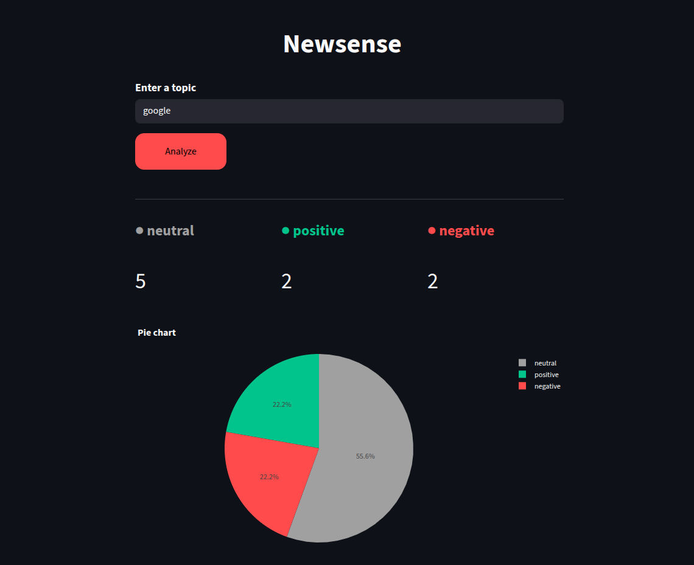

# 📰 Newsense

A real-time news sentiment analysis dashboard powered by RoBERTa model.
Search any topic and instantly see how the media is covering it.

## 🚀 Live Demo

- **Dashboard**: [new-sense.streamlit.app](https://new-sense.streamlit.app)
- **API**: [valentin003-newsense-api.hf.space](https://valentin003-newsense-api.hf.space/docs)



## Features

- Real-time news fetching via NewsAPI
- Sentiment analysis using `cardiffnlp/twitter-roberta-base-sentiment-latest`
- Sentiment distribution chart
- Filter by sentiment, search by keyword, sort by confidence score
- REST API built with FastAPI

## Tech Stack

Python · FastAPI · Streamlit · Plotly · HuggingFace · Pandas · SQLite · NewsAPI

## Architecture

```
Streamlit Cloud (dashboard)
        ↓ HTTP
HuggingFace Spaces (FastAPI)
        ↓
NewsAPI + HuggingFace Inference API + SQLite
```

## Installation

```bash
git clone https://github.com/hadron-lhc/newsense
cd newsense
pip install -r requirements.txt
```

**Run the API:**

```bash
uvicorn api.main:app --reload
```

**Run the dashboard:**

```bash
streamlit run dashboard/app.py
```

**Environment variables** (`.env`):

```
NEWSAPI_KEY=your_key
HF_TOKEN=your_token
```

## Project Structure

```
newsense/
├── api/
│   ├── main.py        # FastAPI endpoints
│   └── models.py      # Pydantic models
├── core/
│   ├── fetcher.py     # NewsAPI integration
│   ├── analyzer.py    # HuggingFace sentiment analysis
│   └── database.py    # SQLite operations
├── dashboard/
│   └── app.py         # Streamlit interface
└── Dockerfile
```
